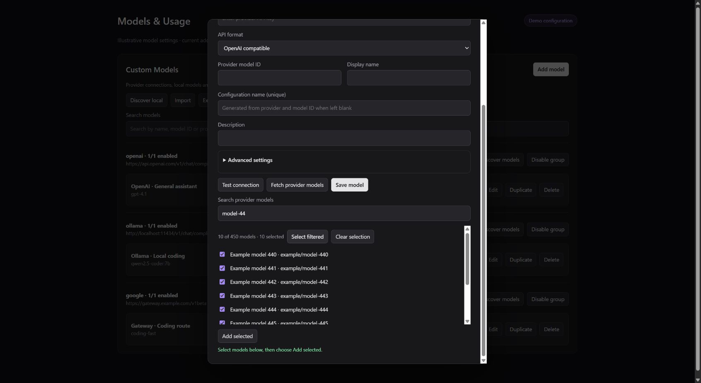
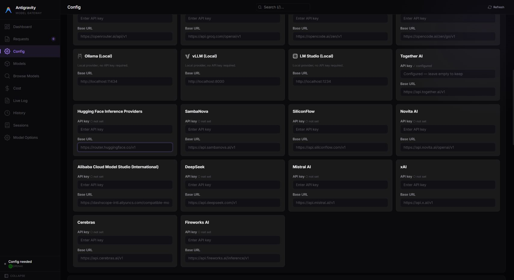

# Providers and model discovery

Choose a provider in **Settings → Models & Usage → Custom Models → Add model**.
The preset fills the endpoint and API format; enter your provider's API key and
an exact model ID. The optional [gateway](../gateway/README.md) has its own
provider credentials and model routes.

## Browse OpenRouter models

1. Select **OpenRouter** and enter your OpenRouter API key.
2. Click **Fetch provider models** to load its current catalog.
3. Use **Search provider models** to filter by model name or ID.
4. Check individual models, or use **Select filtered** to select the visible
   results. Click **Add selected** to save them.

Selections remain selected when you change the search. Use **Clear selection**
before selecting a different group if you only want that group.

*Current addon UI in an isolated browser demo with 450 illustrative model entries.*

The catalog comes from the provider and changes over time. A listed model is
not a promise of account access or tested compatibility with every Antigravity
feature. For agent actions such as reading files or running commands, choose a
model and provider route that support function/tool calling. Image input,
reasoning controls, context limits, pricing, and rate limits also vary by model.
See the [OpenRouter Models API](https://openrouter.ai/docs/api/api-reference/models/list-all-models-and-their-properties)
for the available capability metadata.

## Provider endpoints

These presets use the OpenAI Chat Completions format and Bearer authentication.
The table lists **base URLs**; chat requests append `/chat/completions`.
The desktop editor accepts the preset's full chat URL. Gateway configuration
uses the base URL and the environment variable shown below.

| Provider / ID | Default base URL | Gateway API key | Official documentation |
| --- | --- | --- | --- |
| OpenRouter / `openrouter` | `https://openrouter.ai/api/v1` | `OPENROUTER_API_KEY` | [Models API](https://openrouter.ai/docs/api/api-reference/models/list-all-models-and-their-properties) |
| Together AI / `together` | `https://api.together.ai/v1` | `TOGETHER_API_KEY` | [Chat](https://docs.together.ai/reference/chat-completions), [models](https://docs.together.ai/reference/models) |
| Hugging Face / `huggingface` | `https://router.huggingface.co/v1` | `HUGGINGFACE_API_KEY` or `HF_TOKEN` | [Inference Providers](https://huggingface.co/docs/inference-providers/index) |
| SambaNova / `sambanova` | `https://api.sambanova.ai/v1` | `SAMBANOVA_API_KEY` | [Chat](https://docs.sambanova.ai/docs/api-reference/chat-completions/create-chat-based-completion) |
| SiliconFlow / `siliconflow` | `https://api.siliconflow.com/v1` | `SILICONFLOW_API_KEY` | [Chat](https://docs.siliconflow.com/en/api-reference/chat-completions/chat-completions) |
| Novita AI / `novita` | `https://api.novita.ai/openai/v1` | `NOVITA_API_KEY` | [Chat](https://docs.novita.ai/api-reference/model-apis-llm-create-chat-completion) |
| Alibaba Cloud Model Studio / `dashscope` | `https://dashscope-intl.aliyuncs.com/compatible-mode/v1` | `DASHSCOPE_API_KEY` | [Regions and endpoints](https://www.alibabacloud.com/help/en/model-studio/regions) |
| DeepSeek / `deepseek` | `https://api.deepseek.com/v1` | `DEEPSEEK_API_KEY` | [API guide](https://api-docs.deepseek.com/) |
| Mistral AI / `mistral` | `https://api.mistral.ai/v1` | `MISTRAL_API_KEY` | [API reference](https://docs.mistral.ai/api) |
| xAI / `xai` | `https://api.x.ai/v1` | `XAI_API_KEY` | [Chat Completions](https://docs.x.ai/developers/rest-api-reference/inference/chat-completions) |
| Cerebras / `cerebras` | `https://api.cerebras.ai/v1` | `CEREBRAS_API_KEY` | [Chat](https://inference-docs.cerebras.ai/api-reference/chat-completions) |
| Fireworks AI / `fireworks` | `https://api.fireworks.ai/inference/v1` | `FIREWORKS_API_KEY` | [Chat](https://docs.fireworks.ai/api-reference/post-chatcompletions) |

The complete desktop preset list is maintained in [providers.ts](../src/providers.ts).
For gateway endpoint overrides, use `<PROVIDER_ID>_BASE_URL` in uppercase, such
as `DASHSCOPE_BASE_URL`. Existing saved desktop entries retain their configured
format; see [migration notes](configuration.md#fields-and-advanced-settings)
for older DeepSeek and Fireworks entries.

*Gateway provider settings in an isolated local test profile; no live credentials are shown.*

## Discovery and compatibility notes

| Provider | Discovery behavior and account requirements |
| --- | --- |
| Together AI | `/models` returns an array with multiple model types; discovery selects chat models and reads their display names and context limits. [Models API](https://docs.together.ai/reference/models) |
| Hugging Face | `/models` lists chat models and their serving providers. Use a token with **Make calls to Inference Providers** permission. Model IDs can end in `:fastest`, `:cheapest`, `:preferred`, or a specific provider such as `:groq`. Enter a suffixed ID manually to pin that choice. Context limits and tools can differ between providers serving the same model. [Router and metadata](https://huggingface.co/docs/inference-providers/hub-api) |
| SambaNova | `/models` supplies model IDs and context/output limits. Tool calling requires a compatible model; combining tools with `n > 1` is rejected. [Compatibility](https://docs.sambanova.ai/docs/en/features/openai-compatibility) |
| SiliconFlow | `/models?sub_type=chat` filters out other tasks. The default is the international endpoint; use the endpoint matching your account. Tool calling and thinking combinations depend on the model. [Model listing](https://docs.siliconflow.com/en/api-reference/models/get-model-list) |
| Novita AI | `/models` uses `title` and `context_size` metadata. The current default API prefix is `/openai/v1`. [Model listing](https://docs.novita.ai/api-reference/model-apis-llm-list-models) |
| DashScope | Discovery uses `/api/v1/models` on the configured host, filters for text generation, and follows `page_no` pagination. The default is Singapore/international; region, workspace domain, API key, and model availability must match. [Model listing](https://docs.modelstudio.console.alibabacloud.com/en/model-studio/list-models) |
| Fireworks AI | Discovery reads the public `fireworks` account catalog through `/v1/accounts/fireworks/models`, follows pagination, and filters unavailable or explicitly non-serverless entries. Enter private model IDs or deployment-specific identifiers manually using your deployment's endpoint. [Model listing](https://docs.fireworks.ai/api-reference/list-models) |

Discovery does not generate an answer or exercise tools. Save a small selection
and try the workflow you need. If discovery is unavailable, enter **Provider
model ID** manually. Use **Advanced settings** for supported limits and request
options; a capability override cannot enable a feature the upstream model lacks.
The integrations above use Chat Completions; provider features that require a
different API, such as Responses-only tools, are not enabled by adding a preset.
